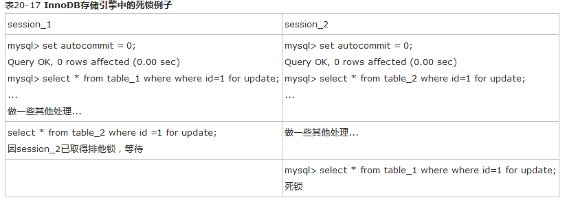
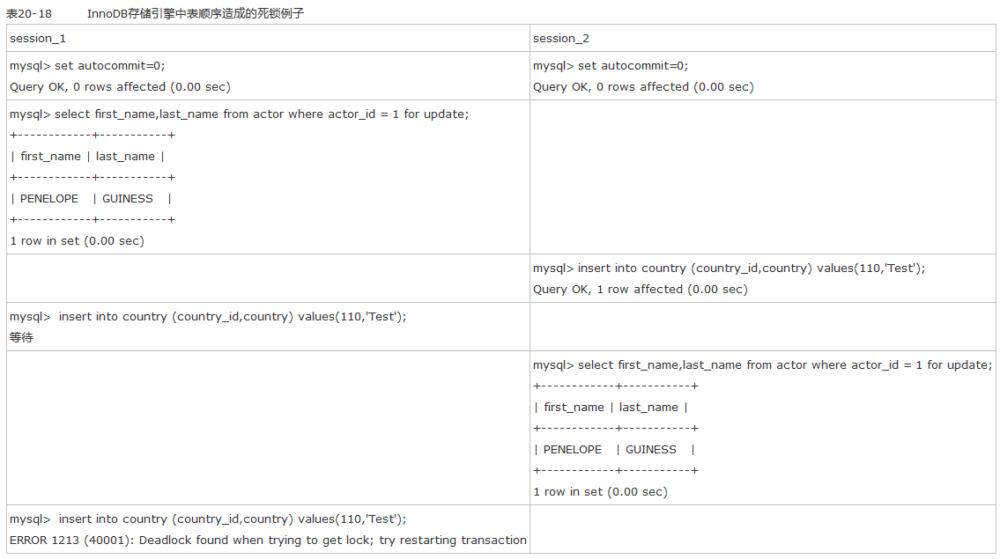
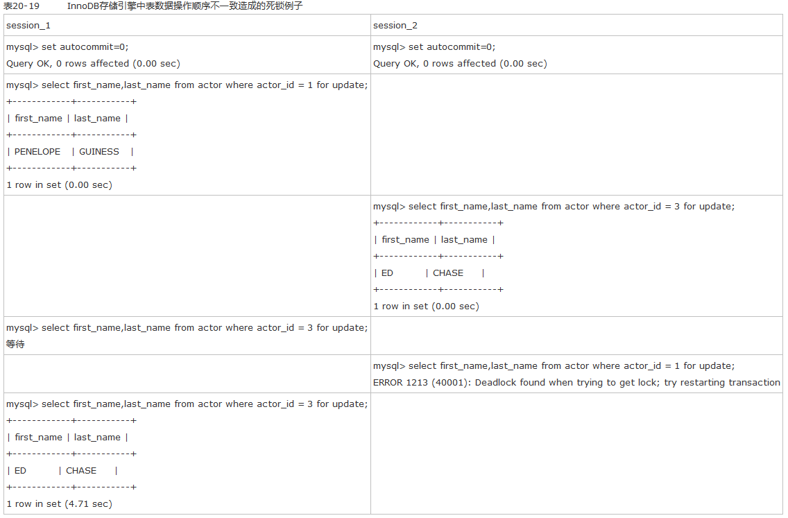
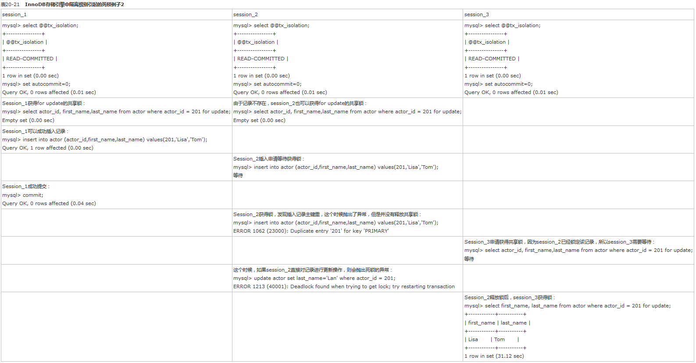

## mysql死锁

锁是计算机协调多个进程或线程并发访问某一资源的机制。在数据库中，除传统的计算资源（如CPU、RAM、I/O等）的争用以外，数据也是一种 供许多用户共享的资源。如何保证数据并发访问的一致性、有效性是所有数据库必须解决的一个问题，锁冲突也是影响数据库并发访问性能的一个重要因素。从这个 角度来说，锁对数据库而言显得尤其重要，也更加复杂。

相对其他数据库而言，MySQL的锁机制比较简单，其最显著的特点是不同的存储引擎支持不同的锁机制。比如，MyISAM和MEMORY存储引 擎采用的是表级锁（table-level locking）；BDB存储引擎采用的是页面锁（page-level locking），但也支持表级锁；InnoDB存储引擎既支持行级锁（row-level locking），也支持表级锁，但默认情况下是采用行级锁。

MySQL这3种锁的特性可大致归纳如下。

- 表级锁：开销小，加锁快；不会出现死锁；锁定粒度大，发生锁冲突的概率最高,并发度最低。
- 行级锁：开销大，加锁慢；会出现死锁；锁定粒度最小，发生锁冲突的概率最低,并发度也最高。
- 页面锁：开销和加锁时间界于表锁和行锁之间；会出现死锁；锁定粒度界于表锁和行锁之间，并发度一般。

### 典型死锁

### 对于MyISAM的表锁，主要讨论了以下几点：
- 共享读锁（S）之间是兼容的，但共享读锁（S）与排他写锁（X）之间，以及排他写锁（X）之间是互斥的，也就是说读和写是串行的。
- 在一定条件下，MyISAM允许查询和插入并发执行，我们可以利用这一点来解决应用中对同一表查询和插入的锁争用问题。
- MyISAM默认的锁调度机制是写优先，这并不一定适合所有应用，用户可以通过设置LOW_PRIORITY_UPDATES参数，或在INSERT、UPDATE、DELETE语句中指定LOW_PRIORITY选项来调节读写锁的争用。
- 由于表锁的锁定粒度大，读写之间又是串行的，因此，如果更新操作较多，MyISAM表可能会出现严重的锁等待，可以考虑采用InnoDB表来减少锁冲突。

### 对于InnoDB表，本章主要讨论了以下几项内容。
- InnoDB的行锁是基于锁引实现的，如果不通过索引访问数据，InnoDB会使用表锁。
- 介绍了InnoDB间隙锁（Next-key)机制，以及InnoDB使用间隙锁的原因。
- 在不同的隔离级别下，InnoDB的锁机制和一致性读策略不同。
- MySQL的恢复和复制对InnoDB锁机制和一致性读策略也有较大影响。
- 锁冲突甚至死锁很难完全避免。

#### 在了解InnoDB锁特性后，用户可以通过设计和SQL调整等措施减少锁冲突和死锁，包括：
- 尽量使用较低的隔离级别；
- 精心设计索引，并尽量使用索引访问数据，使加锁更精确，从而减少锁冲突的机会；
- 选择合理的事务大小，小事务发生锁冲突的几率也更小；
- 给记录集显示加锁时，最好一次性请求足够级别的锁。比如要修改数据的话，最好直接申请排他锁，而不是先申请共享锁，修改时再请求排他锁，这样容易产生死锁；
- 不同的程序访问一组表时，应尽量约定以相同的顺序访问各表，对一个表而言，尽可能以固定的顺序存取表中的行。这样可以大大减少死锁的机会；
- 尽量用相等条件访问数据，这样可以避免间隙锁对并发插入的影响；
- 不要申请超过实际需要的锁级别；除非必须，查询时不要显示加锁；
- 对于一些特定的事务，可以使用表锁来提高处理速度或减少死锁的可能。

### 数据库中的事务是什么？

事务是作为一个逻辑单元执行的一系列操作，一个逻辑工作单元必须有四个属性，称为ACID（原子性、一致性、隔离性和持久性）属性，只有这样才能成为一个事务：

#### 原子性

事务必须是原子工作单元；对于其数据修改，要么全都执行，要么全都不执行。

#### 一致性

事务在完成时，必须使所有的数据都保持一致状态。在相关数据库中，所有规则都必须应用于事务的修改，以保持所有数据的完整性。事务结束时，所有的内部数据结构（如 B 树索引或双向链表）都必须是正确的。
#### 隔离性

由并发事务所作的修改必须与任何其它并发事务所作的修改隔离。事务查看数据时数据所处的状态，要么是另一并发事务修改它之前的状态，要么是另一事务修改它之后的状态，事务不会查看中间状态的数据。这称为可串行性，因为它能够重新装载起始数据，并且重播一系列事务，以使数据结束时的状态与原始事务执行的状态相同。

#### 持久性
事务完成之后，它对于系统的影响是永久性的。该修改即使出现系统故障也将一直保持。