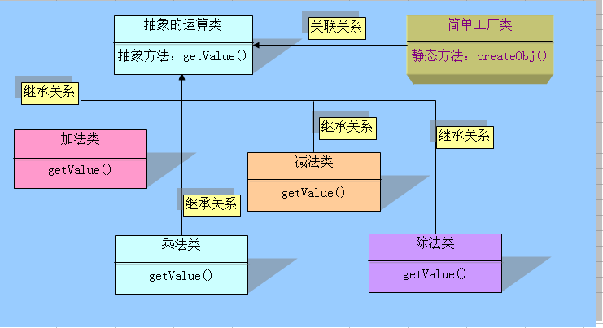

##php设计模式

###单例模式

单例模式顾名思义，就是只有一个实例。作为对象的创建模式， 单例模式确保某一个类只有一个实例，而且自行实例化并向整个系统提供这个实例。

####单例模式的要点有三个：

1. 一是某个类只能有一个实例；
2. 二是它必须自行创建这个实例；
3. 三是它必须自行向整个系统提供这个实例。

####为什么要使用PHP单例模式

1. php的应用主要在于数据库应用, 一个应用中会存在大量的数据库操作, 在使用面向对象的方式开发时, 如果使用单例模式, 则可以避免大量的new 操作消耗的资源,还可以减少数据库连接这样就不容易出现 too many connections情况。
2. 如果系统中需要有一个类来全局控制某些配置信息, 那么使用单例模式可以很方便的实现. 这个可以参看zend Framework的FrontController部分。
3. 在一次页面请求中, 便于进行调试, 因为所有的代码(例如数据库操作类db)都集中在一个类中, 我们可以在类中设置钩子, 输出日志，从而避免到处var_dump, echo。

```php
/**
 * 设计模式之单例模式
 * $_instance必须声明为静态的私有变量
 * 构造函数必须声明为私有,防止外部程序new类从而失去单例模式的意义
 * getInstance()方法必须设置为公有的,必须调用此方法以返回实例的一个引用
 * ::操作符只能访问静态变量和静态函数
 * new对象都会消耗内存
 * 使用场景:最常用的地方是数据库连接。
 * 使用单例模式生成一个对象后，该对象可以被其它众多对象所使用。
 */
class man
{
    //保存例实例在此属性中
    private static $_instance;

    //构造函数声明为private,防止直接创建对象
    private function __construct()
    {
        echo '我被实例化了！';
    }

    //单例方法
    public static function get_instance()
    {
        var_dump(isset(self::$_instance));
        
        if(!isset(self::$_instance))
        {
            self::$_instance=new self();
        }
        return self::$_instance;
    }

    //阻止用户复制对象实例
    private function __clone()
    {
        trigger_error('Clone is not allow' ,E_USER_ERROR);
    }

    function test()
    {
        echo("test");

    }
}

// 这个写法会出错，因为构造方法被声明为private
//$test = new man;

// 下面将得到Example类的单例对象
$test = man::get_instance();
$test = man::get_instance();
$test->test();

// 复制对象将导致一个E_USER_ERROR.
//$test_clone = clone $test;
```

###简单工厂模式

1. 抽象基类：类中定义抽象一些方法，用以在子类中实现
2. 继承自抽象基类的子类：实现基类中的抽象方法
3. 工厂类：用以实例化所有相对应的子类



```php
/**
* 
* 定义个抽象的类，让子类去继承实现它
*
*/
abstract class Operation{
    //抽象方法不能包含函数体
    abstract public function getValue($num1,$num2);//强烈要求子类必须实现该功能函数
}


/**
* 加法类
*/
class OperationAdd extends Operation {
    public function getValue($num1,$num2){
        return $num1+$num2;
    }
}
/**
* 减法类
*/
class OperationSub extends Operation {
    public function getValue($num1,$num2){
        return $num1-$num2;
    }
}
/**
* 乘法类
*/
class OperationMul extends Operation {
    public function getValue($num1,$num2){
        return $num1*$num2;
    }
}
/**
* 除法类
*/
class OperationDiv extends Operation {
    public function getValue($num1,$num2){
        try {
            if ($num2==0){
                throw new Exception("除数不能为0");
            }else {
                return $num1/$num2;
            }
        }catch (Exception $e){
            echo "错误信息：".$e->getMessage();
        }
    }
}
```

如果我们现在需要增加一个求余的类，会非常的简单我们只需要另外写一个类（该类继承虚拟基类）,在类中完成相应的功能（比如：求乘方的运算）,而且大大的降低了耦合度，方便日后的维护及扩展

```php
/**
* 求余类（remainder）
*
*/
class OperationRem extends Operation {
    public function getValue($num1,$num2){
        return $num1%$num12;
    }
}
```

现在还有一个问题未解决,就是如何让程序根据用户输入的操作符实例化相应的对象呢？

解决办法：使用一个单独的类来实现实例化的过程，这个类就是工厂

```php
/**
* 工程类，主要用来创建对象
* 功能：根据输入的运算符号，工厂就能实例化出合适的对象
*
*/
class Factory{
    public static function createObj($operate){
        switch ($operate){
            case '+':
                return new OperationAdd();
                break;
            case '-':
                return new OperationSub();
                break;
            case '*':
                return new OperationSub();
                break;
            case '/':
                return new OperationDiv();
                break;
        }
    }
}
$test=Factory::createObj('/');
$result=$test->getValue(23,0);
echo $result;
```

工厂模式：
以交通工具为例子：要求请既可以定制交通工具，又可以定制交通工具生产的过程
1. 定制交通工具
    1. 定义一个接口，里面包含交工工具的方法（启动 运行 停止）
    2. 让飞机，汽车等类去实现他们
2. 定制工厂（通上类似）
    1. 定义一个接口，里面包含交工工具的制造方法（启动 运行 停止）
    2. 分别写制造飞机，汽车的工厂类去继承实现这个接口

###观察者模式

 观察者模式属于行为模式，是定义对象间的一种一对多的依赖关系，以便当一个对象的状态发生改变时，所有依 赖于它的对象都得到通知并自动刷新。它完美的将观察者对象和被观察者对象分离。可以在独立的对象（主体）中维护一个对主体感兴趣的依赖项（观察器）列表。 让所有观察器各自实现公共的 Observer 接口，以取消主体和依赖性对象之间的直接依赖关系。

```php
class MyObserver1 implements SplObserver {
    public function update(SplSubject $subject) {
        echo __CLASS__ . ' - ' . $subject->getName();
    }
}

class MyObserver2 implements SplObserver {
    public function update(SplSubject $subject) {
        echo __CLASS__ . ' - ' . $subject->getName();
    }
}

class MySubject implements SplSubject {
    private $_observers;
    private $_name;

    public function __construct($name) {
        $this->_observers = new SplObjectStorage();
        $this->_name = $name;
    }

    public function attach(SplObserver $observer) {
        $this->_observers->attach($observer);
    }

    public function detach(SplObserver $observer) {
        $this->_observers->detach($observer);
    }

    public function notify() {
        foreach ($this->_observers as $observer) {
            $observer->update($this);
        }
    }

    public function getName() {
        return $this->_name;
    }
}

$observer1 = new MyObserver1();
$observer2 = new MyObserver2();

$subject = new MySubject("test");

$subject->attach($observer1);
$subject->attach($observer2);
$subject->notify(); 
```

###策略模式

在此模式中，算法是从复杂类提取的，因而可以方便地替换。例如，如果要更改搜索引擎中排列页的方法，则策略模式是一个不错的选择。思考一下搜索引擎的几个部分 —— 一部分遍历页面，一部分对每页排列，另一部分基于排列的结果排序。在复杂的示例中，这些部分都在同一个类中。通过使用策略模式，您可将排列部分放入另一个类中，以便更改页排列的方式，而不影响搜索引擎的其余代码。

作为一个较简单的示例，下面 显示了一个用户列表类，它提供了一个根据一组即插即用的策略查找一组用户的方法

```php
//定义接口
interface IStrategy {
    function filter($record);
}
//实现接口方式1
class FindAfterStrategy implements IStrategy {
    private $_name;
    public function __construct($name) {
        $this->_name = $name;
    }
    public function filter($record) {
        return strcmp ( $this->_name, $record ) <= 0;
    }
}
//实现接口方式1
class RandomStrategy implements IStrategy {
    public function filter($record) {
        return rand ( 0, 1 ) >= 0.5;
    }
}
//主类
class UserList {
    private $_list = array ();
    public function __construct($names) {
        if ($names != null) {
            foreach ( $names as $name ) {
                $this->_list [] = $name;
            }
        }
    }
    
    public function add($name) {
        $this->_list [] = $name;
    }
    
    public function find($filter) {
        $recs = array ();
        foreach ( $this->_list as $user ) {
            if ($filter->filter ( $user ))
                $recs [] = $user;
        }
        return $recs;
    }
}
$ul = new UserList ( array (
        "Andy",
        "Jack",
        "Lori",
        "Megan" 
) );
$f1 = $ul->find ( new FindAfterStrategy ( "J" ) );
print_r ( $f1 );
$f2 = $ul->find ( new RandomStrategy () );
print_r ( $f2 );
```

策略模式非常适合复杂数据管理系统或数据处理系统，二者在数据筛选、搜索或处理的方式方面需要较高的灵活性。