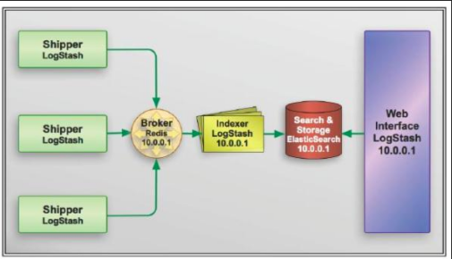

## 集中式日志搜集系统

### ELK（ElasticSearch、Logstash和Kibana）

一个完整的集中式日志系统，主要有以后几个特点：

1. 收集－能够采集多种来源的日志数据
2. 传输－能够稳定的把日志数据传输到中央系统
3. 存储－如何存储日志数据
4. 分析－可以支持 UI 分析
5. 警告－能够提供错误报告，监控机制。

#### Elasticsearch

Elasticsearch 是一个实时分布式搜索和分析引擎，可以用于全文搜索，结构化搜索以及分析等。它是一个建立在全文搜索引擎 Apache Lucene 基础上的搜索引擎，使用 Java 语言编写。

主要特点：

1. 实时分析
2. 分布式实时文件存储，并将每一个字段都编入索引
3. 文档导向，所有的对象全部是文档
4. 高可用性，易扩展，支持集群（Cluster）、分片和复制（Shards 和 Replicas）。
5. 接口友好，支持JSON

关于Elasticsearch的几个要术语及解释：

###### cluster

代表一个集群，集群中有多个节点，其中有一个为主节点，这个主节点是可以通过选举产生 的，主从节点是对于集群内部来说的。es的一个概念就是去中心化，字面上理解就是无中心节点，这是对于集群外部来说的，因为从外部来看es集群，在逻辑上 是个整体，你与任何一个节点的通信和与整个es集群通信是等价的。 

###### shards 
代表索引分片，es可以把一个完整的索引分成多个分片，这样的好处是可以把一个大的索引拆分成多个，分布到不同的节点上。构成分布式搜索。分片的数量只能在索引创建前指定，并且索引创建后不能更改。 

###### replicas

代表索引副本，es可以设置多个索引的副本，副本的作用一是提高系统的容错性，当个某个节点某个分片损坏或丢失时可以从副本中恢复。二是提高es的查询效率，es会自动对搜索请求进行负载均衡。 

###### recovery

代表数据恢复或叫数据重新分布，es在有节点加入或退出时会根据机器的负载对索引分片进行重新分配，挂掉的节点重新启动时也会进行数据恢复。 

###### river

代 表es的一个数据源，也是其它存储方式（如：数据库）同步数据到es的一个方法。它是以插件方式存在的一个es服务，通过读取river中的数据并把它索 引到es中，官方的river有couchDB的，RabbitMQ的，Twitter的，Wikipedia的，river这个功能将会在后面的文件中 重点说到。 

##### gateway

代表es索引的持久化存储方式，es默认是先把索引 存放到内存中，当内存满了时再持久化到硬盘。当这个es集群关闭再重新启动时就会从gateway中读取索引数据。es支持多种类型的gateway，有 本地文件系统（默认），分布式文件系统，Hadoop的HDFS和amazon的s3云存储服务。 

##### discovery.zen

代表es的自动发现节点机制，es是一个基于p2p的系统，它先通过广播寻找存在的节点，再通过多播协议来进行节点之间的通信，同时也支持点对点的交互。 

###### Transport

代表es内部节点或集群与客户端的交互方式，默认内部是使用tcp协议进行交互，同时它支持http协议（json格式）、thrift、servlet、memcached、zeroMQ等的传输协议（通过插件方式集成）。

#### Logstash

Logstash是一款轻量级的日志搜集处理框架，可以方便的把分散的、多样化的日志搜集起来，并进行自定义的处理，然后传输到指定的位置，比如某个服务器或者文件。使用 JRuby 语言编写。

主要特点：

1. 几乎可以访问任何数据
2. 可以和多种外部应用结合
3. 支持弹性扩展

它由三个主要部分组成： 

1. Shipper－发送日志数据
2. Broker－收集数据，缺省内置 Redis
3. Indexer－数据写入

#### ELK 协议栈体系结构

完整的 ELK 协议栈体系结构见图 5。基本流程是 Shipper 负责从各种数据源里采集数据，然后发送到 Broker，Indexer 将存放在 Broker 中的数据再写入 Elasticsearch，Elasticsearch 对这些数据创建索引，然后由 Kibana 对其进行各种分析并以图表的形式展示。

