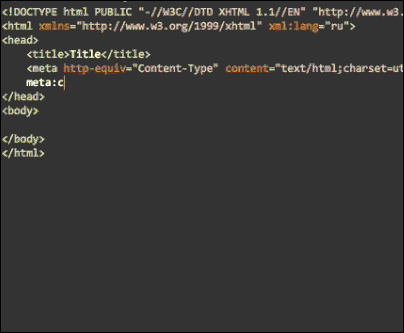

##sublime的Emmet使用方法

Emmet的前身是大名鼎鼎的Zen coding，如果你从事Web前端开发的话，对该插件一定不会陌生。它使用仿CSS选择器的语法来生成代码，大大提高了HTML/CSS代码编写的速度，比如下面的演示： 



###快速编写HTML代码

####初始化

HTML文档需要包含一些固定的标签，比如html、head、body等，现在你只需要1秒钟就可以输入这些标签。比如输入“!”或“html:5”，然后按Tab键:


- html:5 或!：用于HTML5文档类型
- html:xt：用于XHTML过渡文档类型
- html:4s：用于HTML4严格文档类型

####轻松添加类、id、文本和属性

连续输入元素名称和ID，Emmet会自动为你补全，比如输入p#foo:


连续输入类和id，比如p.bar#foo，会自动生成： 

```html
<p class="bar" id="foo"></p>  
```

下面来看看如何定义HTML元素的内容和属性。你可以通过输入h1{foo}和a[href=#]，就可以自动生成如下代码：

```html
    <h1>foo</h1>  
    <a href="#"></a> 
```


####嵌套

现在你只需要1行代码就可以实现标签的嵌套。

- \>：子元素符号，表示嵌套的元素
- +：同级标签符号
- ^：可以使该符号前的标签提升一行

效果如下图所示：


####分组

你可以通过嵌套和括号来快速生成一些代码块，比如输入(.foo>h1)+(.bar>h2)，会自动生成如下代码： 

```html
    <div class="foo">  
      <h1></h1>  
    </div>  
    <div class="bar">  
      <h2></h2>  
    </div>  
```


####隐式标签

声明一个带类的标签，只需输入div.item，就会生成\<div class="item"\>\</div\>。

在过去版本中，可以省略掉div，即输入.item即可生成\<div class="item"\>\</div\>。现在如果只输入.item，则Emmet会根据父标签进行判定。比如在\<ul\>中输入.item，就会生成\<li class="item"\>\</li\>。


下面是所有的隐式标签名称：

- li：用于ul和ol中
- tr：用于table、tbody、thead和tfoot中
- td：用于tr中
- option：用于select和optgroup中

####定义多个元素

要定义多个元素，可以使用\*符号。比如，ul\>li\*3可以生成如下代码：

```html
    <ul>  
      <li></li>  
      <li></li>  
      <li></li>  
    </ul>   
```


####定义多个带属性的元素

如果输入 ul\>li.item$*3，将会生成如下代码：

```html
    <ul>  
      <li class="item1"></li>  
      <li class="item2"></li>  
      <li class="item3"></li>  
    </ul>  
```


###CSS缩写

####值

比如要定义元素的宽度，只需输入w100，即可生成:

```css
width: 100px;
```


除了px，也可以生成其他单位，比如输入h10p+m5e，结果如下： 

```css
height: 10%;  
margin: 5em;
```

单位别名列表：

- p 表示%
- e 表示 em
- x 表示 ex

####附加属性

可能你之前已经了解了一些缩写，比如 @f，可以生成：

```css
@font-face {  
  font-family:;  
  src:url();  
} 
```

一些其他的属性，比如background-image、border-radius、font、@font-face,text-outline、text-shadow等额外的选项，可以通过“+”符号来生成，比如输入@f+，将生成： 

```css
    @font-face {  
      font-family: 'FontName';  
      src: url('FileName.eot');  
      src: url('FileName.eot?#iefix') format('embedded-opentype'),  
         url('FileName.woff') format('woff'),  
         url('FileName.ttf') format('truetype'),  
         url('FileName.svg#FontName') format('svg');  
      font-style: normal;  
      font-weight: normal;  
    }  
```


####模糊匹配

如果有些缩写你拿不准，Emmet会根据你的输入内容匹配最接近的语法，比如输入ov:h、ov-h、ovh和oh，生成的代码是相同的： 

```css
overflow: hidden;
```


####供应商前缀

如果输入非W3C标准的CSS属性，Emmet会自动加上供应商前缀，比如输入trs，则会生成：

```css
    -webkit-transform: ;  
    -moz-transform: ;  
    -ms-transform: ;  
    -o-transform: ;  
    transform: ;  
```


你也可以在任意属性前加上“-”符号，也可以为该属性加上前缀。比如输入-super-foo： 

```css
    -webkit-super-foo: ;  
    -moz-super-foo: ;  
    -ms-super-foo: ;  
    -o-super-foo: ;  
    super-foo: ;  
```

如果不希望加上所有前缀，可以使用缩写来指定，比如-wm-trf表示只加上-webkit和-moz前缀：

```css
-webkit-transform: ;  
-moz-transform: ;  
transform: ; 
```

前缀缩写如下：

- w 表示 -webkit-
- m 表示 -moz-
- s 表示 -ms-
- o 表示 -o-

####渐变

输入lg(left, #fff 50%, #000)，会生成如下代码：

```css
    background-image: -webkit-gradient(linear, 0 0, 100% 0, color-stop(0.5, #fff), to(#000));  
    background-image: -webkit-linear-gradient(left, #fff 50%, #000);  
    background-image: -moz-linear-gradient(left, #fff 50%, #000);  
    background-image: -o-linear-gradient(left, #fff 50%, #000);  
    background-image: linear-gradient(left, #fff 50%, #000); 
```

